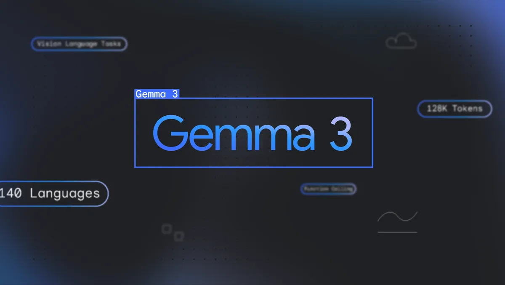

<link rel="stylesheet" href="./assets/style.css">
<meta name="viewport" content="width=device-width, initial-scale=1">

<table class="centered-table">
  <tr>
    <td><a href="/ai-ml/index.md">AI/ML</a></td>
    <td><a href="/photography/index.md">Photography</a></td>
    <td><a href="/book-summaries/index.md">Book Summaries</a></td>
    <td><a href="./general/about.html">About</a></td>
  </tr>
</table>

    
    

        <h3 class="card-title">Google Gemma3 Release</h3>
        
 Gemma 3 comes in a range of sizes (1B, 4B, 12B and 27B)

        <a href="./ai-ml/gemma-3-release.html" class="card-link">Read More</a>
    

