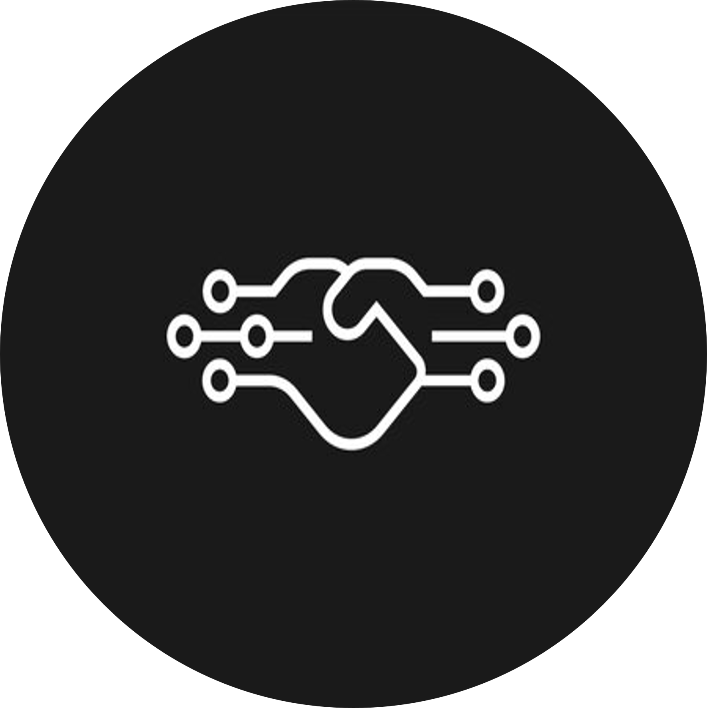

<link rel="stylesheet" href="./assets/style.css">
<meta name="viewport" content="width=device-width, initial-scale=1">

    

        
        

            <h3 class="card-title">Google Gemma3 Release</h3>
            
 Gemma 3 comes in a range of sizes (1B, 4B, 12B and 27B).

            <a href="./ai-ml/gemma-3-release.html" class="card-link">Read More</a>
        

    

      

        
        

            <h3 class="card-title">Prompt Engineering Guide</h3>
            
This series (WIP) is a guide to effective prompting!

            <a href="./ai-ml/prompting-series.html" class="card-link">Read More</a>
        

    

    

    
    

        <h3 class="about-card-title">Welcome to Deepmatics!</h3>
        
Read more about the authors!

        <a href="./general/about.html" class="about-card-link">Read More</a>
    

