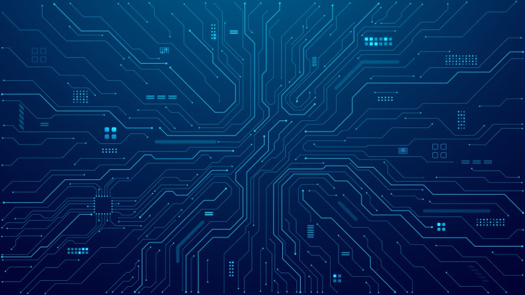

  <!-- Left Sidebar -->
  

    
    <h3>About Me</h3>
    
Hello! I'm <strong>Satish</strong>, the creator of Deepmatics. I'm passionate about AI/ML, photography, and exploring the depths of knowledge through books. Welcome to my space!

  

  <!-- Main Content -->
  

    # Welcome to Deepmatics Blog!
    > **Exploring the frontiers of AI/ML, creativity, and books.**

    ## **Featured Post**
    
    ### [How AI is Transforming the World](./ai-ml/ai-transforming-world.md)
    *January 26, 2025*  
    Discover how artificial intelligence is impacting industries globally, from healthcare to transportation.

    ## **Latest Articles**

    ### AI/ML
    - [Understanding Neural Networks](./ai-ml/neural-networks.md)  
      *January 15, 2025*  
      Learn the basics of neural networks and their applications.

    - [What is GPT?](./ai-ml/what-is-gpt.md)  
      *January 10, 2025*  
      A deep dive into Generative Pretrained Transformers.

    ### Photography
    - [Capturing Nature with a Lens](./photography/nature-photography.md)  
      *January 20, 2025*  
      Tips and tricks for stunning nature photography.

    ### Book Summaries
    - [Atomic Habits: A Summary](./book-summaries/atomic-habits.md)  
      *January 12, 2025*  
      Key insights from James Clear’s bestselling book.
  

